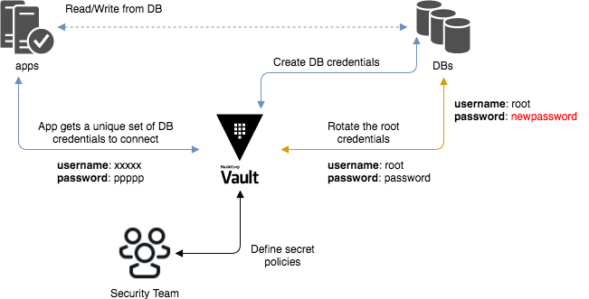
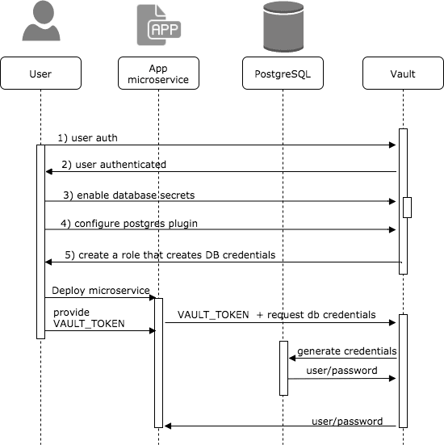

### Database Dynamic Secrets with Vault

##### https://github.com/kecorbin/vault-demo

---?image=https://www.datocms-assets.com/2885/1542059918-hashicorpshare-imgfull-stack-graphic1200x630.png
@title[HashiCorp Overview]

Note:

- Terraform enables you to safely and predictably create, change, and improve infrastructure. It is an open source tool that codifies APIs into declarative configuration files that can be shared amongst team members, treated as code, edited, reviewed, and versioned.
- Vault tightly controls access to secrets and encryption keys by authenticating against trusted sources of identity such as Active Directory, LDAP, Kubernetes, CloudFoundry, and cloud platforms. Vault enables fine grained authorization of which users and applications are permitted access to secrets and keys.
- Nomad is a flexible container orchestration tool that enables an organization to easily deploy and manage any containerized or legacy application using a single, unified workflow.
- Consul is a service mesh solution providing a full featured control plane with service discovery, configuration, and segmentation functionality. Each of these features can be used individually as needed, or they can be used together to build a full service mesh

---
@title[Vault Architecture]

#### Vault Architecture

---
@title[Shamir's Secret Sharing]
#### Shamir's Secret Sharing

---
@title[Solution Overview]
### Solution Overview
@snap[west span-50]

@snapend

@snap[east span-50]

@snapend

---?code=scripts/configure-vault.sh&lang=bash&color=#1E1F21&title=Configure Vault
@title[Configure Vault]

---?code=scripts/create-users.sh&lang=bash&color=#1E1F21&title=Create Users
@title[Create Users]

---?code=scripts/generate-credentials.sh&lang=bash&color=#1E1F21&title=Generate Credentials
@title[Generate Credentials]

---
@title[Resources]
### Resources

[Vault Documentation](https://www.vaultproject.io/docs/vs/index.html)
[Database Secrets Engine](https://www.vaultproject.io/docs/secrets/databases/index.html)
[Slide Credits (and a good blog)](https://dev.to/xfrarod/dynamically-securing-databases-using-hashicorp-vault-2kf)
[Demo Inspiration](https://github.com/sethvargo/vault-demo)
