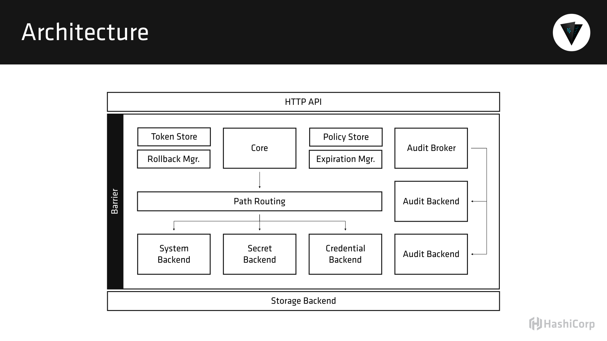
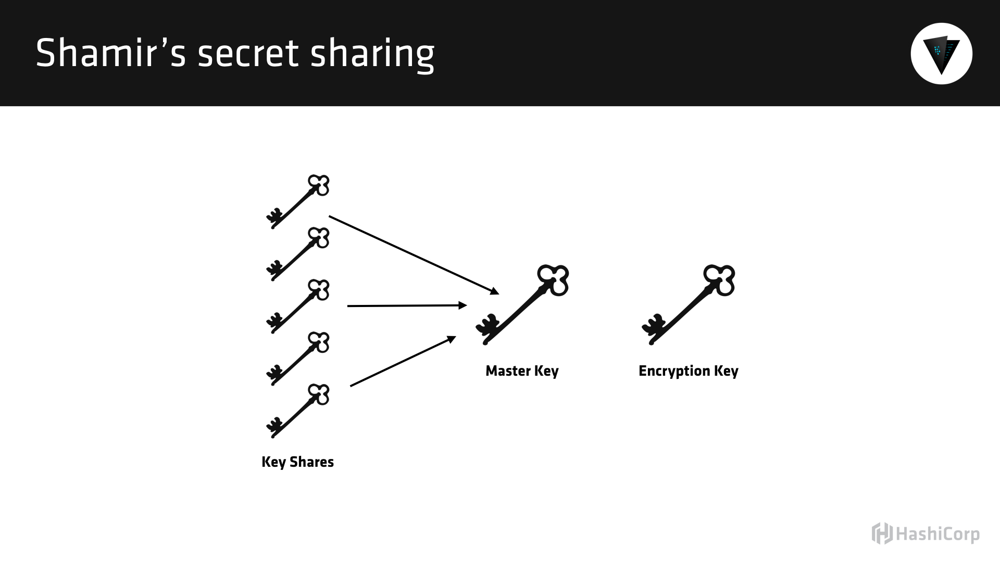

## London HUG

This README contains the rough outline for the content I discussed at the [London HashiCorp User Group on September 15](http://www.meetup.com/London-HashiCorp-User-Group/events/233259372/).

This outline was written in advance of the meetup, so questions and digressions that took place in person may not be captured. Sorry!

This demo used vault_0.6.1, but the concepts are largely applicable to most modern Vault versions.

There are Terraform configurations in the `terraform` directory, but they are not designed for general use. You can borrow things, but they are pretty AWS-and-demo specific.

## Architecture

Vault users a client-server model architecture, and the [vault binary](https://releases.hashicorp.com/vault/0.6.1/) is capable of running in either client or server mode (but not both at the same time, since the server is a daemon).

One thing that sets Vault apart is its pure HTTP(S) API. All interactions with a Vault server take place over a standard HTTP API. This allows for easy application-level integrations.



To ensure that no one person has complete control in the system, Vault employs a technique from computer science known as [Shamir's Secret Sharing](https://en.wikipedia.org/wiki/Shamir%27s_Secret_Sharing).



## Getting Started

First we need to configure our local client to talk to the remote Vault server. I have already provisioned this server in advance using [Terraform](https://www.terraform.io/). We can do this by setting the `VAULT_ADDR` environment variable:

```
$ export VAULT_ADDR=http://vault.hashicorp.rocks
```

This server is not designed to be a "best-practices" Vault server and is mostly designed for demonstrations such as this. It is not production ready. Please do not use this Vault setup in production - you will be on the front page of Hacker News defending yourself as to why you got hacked.

We can check the status of the Vault:

```
$ vault status
```

It looks like we are ready to go!

## Authenticating

The first thing we need to do is authenticate to the Vault. Because this Vault is completely unconfigured, we need to use the root token to get started. Normally this is an auto-generated UUID, but I cheated and made it "root" to make the demo easier.

```
$ vault auth root
```

We will explore other authentication mechanisms later if time remains.

## Static Secrets

There are two kinds of secrets in Vault - static and dynamic. Dynamic secrets have enforced leases and usually expire after a short period of time. Static secrets are refresh intervals, but they do not expire unless explicitly removed.

The easiest way to think about static secrets is "encrypted redis" or "encrypted memcached". Vault exposes an encrypted key-value store such that all data written is encrypted and stored.

Let's go ahead and write, read, update, and delete some static secrets:

```
$ vault write secret/foo value=my-secret-value
Success! Data written to: secret/foo
```

```
$ vault read secret/foo
Key             	Value
---             	-----
refresh_interval	720h0m0s
value           	my-secret-value
```

```
$ vault write secret/foo value=new-secret author=sethvargo
Success! Data written to: secret/foo
```

```
$ vault read secret/foo
Key             	Value
---             	-----
refresh_interval	720h0m0s
author          	sethvargo
value           	new-secret
```

```
$ vault list secret/
Keys
----
foo
```

## Policies

What if I want to restrict access to this secret so that only certain users have access? Vault's path-based policy model makes this easy. We simply need to author and upload a policy to the Vault server.

Everything in Vault is deny by default - let's check that now. First, we will create a new token, but assign it no policies. This means the token has very limited permission in the system:

```
$ vault token-create -policy=default
Key            	Value
---            	-----
token          	8983061f-56f1-7e5f-bbb4-647c3b835d5c
token_accessor 	1b15e9dc-fcc7-33ef-bdb3-7d0731ef9152
token_duration 	720h0m0s
token_renewable	true
token_policies 	[default]
```

Now if we "login" as this token using the `vault auth` command, we will not be able to look up the secret we just created:

```
$ vault auth 8983061f-56f1-7e5f-bbb4-647c3b835d5c
Successfully authenticated! You are now logged in.
token: 8983061f-56f1-7e5f-bbb4-647c3b835d5c
token_duration: 2591986
token_policies: [default]
```

```
$ vault read secret/foo
Error reading secret/foo: Error making API request.

URL: GET http://127.0.0.1:8200/v1/secret/foo
Code: 403. Errors:

* permission denied
```

Let's re-authenticate as our root user so we can keep going:

```
$ vault auth root
Successfully authenticated! You are now logged in.
token: root
token_duration: 0
token_policies: [root]
```

Policies are written in HashiCorp Configuration Language (HCL), and we can easily author our own. For example, here is a policy that would just grant read access to the `secret/foo` path:

```hcl
path "secret/foo" {
  capabilities = ["read"]
}
```

But we could also grant total access on the `secret/` path by using a splat:

```hcl
path "secret/*" {
  capabilities = ["read"]
}
```

Note this is only granting read permissions. Now we need to upload this to the Vault server.

```
$ vault policy-write secret-readonly ./secret-readonly.hcl
```

Now let's create a token that is attached to that policy:

```
$ vault token-create -policy=secret-readonly
```

And authenticate:

```
$ vault auth 9f167698-3a6d-581b-255c-8e51c7b650ee
Successfully authenticated! You are now logged in.
token: 9f167698-3a6d-581b-255c-8e51c7b650ee
token_duration: 2591988
token_policies: [default secret-readonly]
```

And then try to read the secret:

```
$ vault read secret/foo
Key             	Value
---             	-----
refresh_interval	720h0m0s
author          	sethvargo
value           	new-secret
```

But notice that we cannot update or delete secrets:

```
$ vault write secret/foo value=hello
Error writing data to secret/foo: Error making API request.

URL: PUT http://vault.hashicorp.rocks/v1/secret/foo
Code: 403. Errors:

* permission denied
```

Re-auth as root to continue:

```
$ vault auth root
```

## Dynamic Secrets

While Vault can easily replace your existing K/V secret solution, its real power comes from the secret acquisition engine. Vault can act as the "root" user to many databases and services to dynamically generate sub-accounts based on policy. Let's take a look at Postgres, for example.

Most backends in Vault need to be mounted before use:

```
$ vault mount postgresql
Successfully mounted 'postgresql' at 'postgresql'!
```

Now we can use the `path-help` command to figure how how to configure this thing...

```
$ vault path-help postgresql/
```

It looks like there is a `config/connection` endpoint - that looks interesting.

```
$ vault path-help postgresql/config/connection
```

Great - we just need to give Vault the connection URL to our Postgres database. Well it just so happens that a Postgres database is already installed and configured on this instance, so let's wire it up:

```
$ vault write postgresql/config/connection connection_url=postgresql://postgres@localhost/myapp
```

We get a warning back, but that is just telling us that the connection URL includes credentials, and we should be careful with our ACLs.

Now we have to create a "role" that will map to particular type of postgres user. (In postgres, users are called roles). This is super-annoying to type, but you only need to do it once! Yay! But I cheated and put it in a file.

Here is the SQL - the things between `{{ }}` get filled in by Vault automatically:

```
$ cat pg-vault.sql
...
```

We can tell Vault to read the contents of this file from disk using the `@` symbol:

```
$ vault write postgresql/roles/readonly sql=@pg-vault.sql
```

Now Vault is configured with the ability to dynamically generate postgres users on demand. We can generate new credentials by reading from the "creds" path with the name of the role.

```
$ vault read postgresql/creds/readonly
Key            	Value
---            	-----
lease_id       	postgresql/creds/readonly/16c66048-8dd0-df3d-9208-d815887b6887
lease_duration 	720h0m0s
lease_renewable	true
password       	87788e92-a0c9-6e60-b8f4-d836c06ebec1
username       	token-bbd6454a-40f5-473a-380f-4046540eff00
```

This is a real username and password that can be used to login to Vault:

```
$ psql -H vault.hashicorp.rocks -U token-bbd6454a-40f5-473a-380f-4046540eff00
Password for user token-bbd6454a-40f5-473a-380f-4046540eff00:
```

If we `/du` in the psql console, you will notice that our user is valid for about one hour (UTC) from now. At that time, both Vault and Postgres will revoke the user, but we can revoke it sooner with `vault revoke` and the lease_id.

Let's quickly make a policy that allows users to read from this path:

```hcl
path "postgresql/creds/readonly" {
  capabilities = ["read"]
}
```

And upload this as pg-readonly.

```
$ vault policy-write pg-readonly pg-readonly.hcl
```

## API

Vault provides a full HTTP(S) API. In fact, even the CLI is just a wrapper around that API. Just to prove it to you, let me make you all a token...

```
$ vault token-create -id="meetups-love-vault" -policy=pg-readonly
Key            	Value
---            	-----
token          	meetups-love-vault
token_accessor 	b3134f0d-65d2-d863-72f3-80122df59819
token_duration 	720h0m0s
token_renewable	true
token_policies 	[default pg-readonly]
```

This token is only allowed to generate readonly credentials in Vault. Let's try it out. Go ahead and open up those laptops and fire up a terminal:

```
$ curl -H "X-Vault-Token:meetups-love-vault" http://vault.hashicorp.rocks/v1/postgresql/creds/readonly
{"request_id":"6710c6a9-0bb5-0812-9837-ac8287725a3d","lease_id":"postgresql/creds/readonly/9151a285-9ced-e8c3-d29b-43d1b4fe7615","renewable":true,"lease_duration":2592000,"data":{"password":"21f1828b-3b2a-6f39-8d5f-b93f39f9bfa3","username":"token-c34b940f-abba-34c4-b32e-1b66455b0d33"},"wrap_info":null,"warnings":null,"auth":null}
```

BAM! Look at that. Database Secrets as a Service (tm)! No more calling up a DBA and filing a JIRA ticket... but the DBA can bring their expertise and help codify the policies into this service.

But oh no! This is a HUGE security hole. Y'all have access to my production database. I better revoke this token!

```
$ vault token-revoke meetups-love-vault
```

If we jump on that instance and login as the root postgres user, you can see all the users are gone (except the root user and the one we made earlier).


## Transit

The transit backend provides "encryption as a service" and allows round-tripping of data through Vault. This data is never actually stored in Vault, so the memory footprint is relatively low (as compared with the generic secret backend, for example). The transit backend behaves very simliar to Amazon's KMS service, if you are familiar.

As with postgresql, we must mount the backend first:

```
$ vault mount transit
```

And then we need to create a named encryption key. Vault will create the high-entropy key itself, but we give the key a name and path:

```
$ vault write -f transit/keys/thoughtworks
Success! Data written to: transit/keys/thoughtworks
```

This created a new key. Now we can encrypt and decrypt data (if our policy permits) at this key. All data is base64 encoded to ensure safe transport over HTTP:

```
$ vault write transit/encrypt/thoughtworks plaintext=$(echo "hi" | base64)
Key       	Value
---       	-----
ciphertext	vault:v1:4CM7NTCTIL89z6RoMbxcK/9lXWvTk6nStVZQiZISKw==
```

It is our application's responsibility to store this text, maybe in a database. When we want the plaintext value back, we simply query Vault with the ciphertext:

```
$ vault write transit/decrypt/thoughtworks ciphertext=vault:v1:4CM7NTCTIL89z6RoMbxcK/9lXWvTk6nStVZQiZISKw==
Key      	Value
---      	-----
plaintext	aGkK
```

That plaintext is base64 encoded, so:

```
$ echo aGkK | base64 --decode
hi
```

The transit endpoint supports key rotation as well. If the policy allows, we can trigger a key rotation:

```
$ vault write -f transit/keys/thoughtworks/rotate
Success! Data written to: transit/keys/thoughtworks/rotate
```

This will add a new encryption key to a ring, and data will be upgraded to the new version on the fly automatically. We could optionally have an application that iterates through the data and "rewraps" to the new encryption key. The advantage to the rewrap endpoint is that we never disclose the plaintext to the process - both the input and output are ciphertext. Here is what that looks like:

```
$ vault write transit/rewrap/thoughtworks ciphertext=vault:v1:4CM7NTCTIL89z6RoMbxcK/9lXWvTk6nStVZQiZISKw==
Key       	Value
---       	-----
ciphertext	vault:v2:4vJwSOWt1f/1DbWY89bD4hrNdlLKiZs73KLJzXglbA==
```

We could have a relatively un-trusted process perform the rewrap operation, because it never discloses the plaintext.

Lastly, it may be tempting to have per-row encryption keys (like in a database). However, you should not do this. That means Vault needs to maintain one encryption key per row, and that will bloat over time. Instead you can use [derived keys](https://www.vaultproject.io/docs/secrets/transit/), which allow a per-context encryption value.

## Unsealing the Vault

We talked a lot about this, and, frankly, I don't remember all the details of the conversation :).
